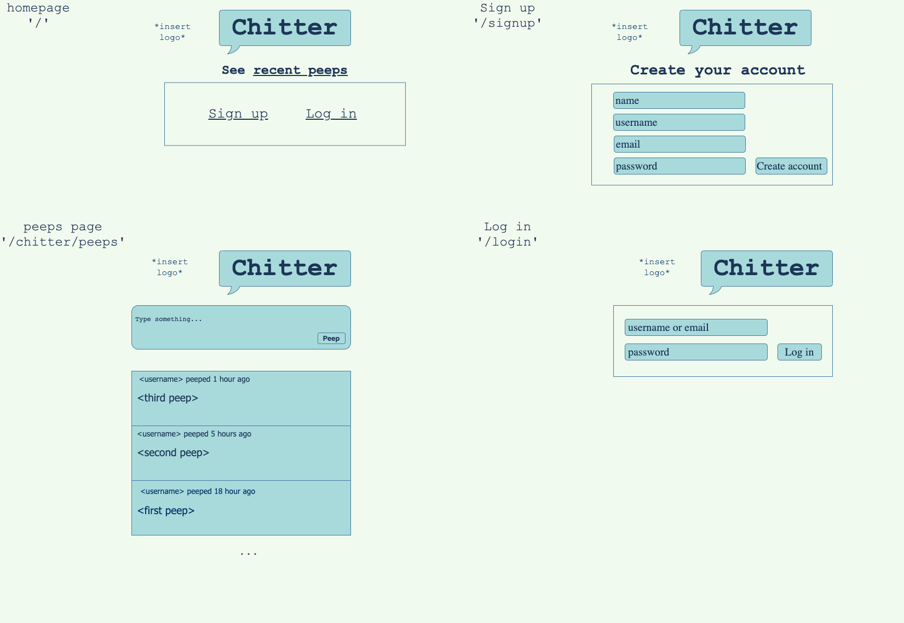

Chitter Challenge
=================
Chitter is a small Twitter clone that allows users to post messages to a public wall.

## Technologies
This app was created using [Express](https://expressjs.com/) and [EJs](https://ejs.co/). The database is managed with [Postgres](https://www.postgresql.org/) and uses the ORM [Sequelize](https://sequelize.org/). Tests have been written and run using [Cypress](https://www.cypress.io/).

## Instructions
Fork this repo, avigate to your chosen directory and clone from your terminal
```bash
git clone git@github.com:hanna-98/chitter-challenge.git
```
Install dependencies 
```
npm install
```
Create a .env file and add these ennvironment variables:
```bash
# be sure not to include spaces
DATABASE='your database name'
DATABASE_USER='your postgres username'
DATABASE_PASSWORD='your postgres password if you have one'
SESSIONS_SECRET='choose a password for sessions'
```
Create and migrate development and test databases
```
npx sequelize-cli db:create
npx sequelize-cli db:migrate
NODE_ENV=test npx sequelize-cli db:create
NODE_ENV=test npx sequelize-cli db:migrate
```
Start the Postgres server 
```bash
pg_ctl -D /usr/local/var/postgres start
```
To run the app:
```bash
node app.js
# or
npx nodemon app.js
```
To run the tests:
```bash
# start the app in the test environment 
NODE_ENV=test npx nodemon app.js
# then open cypress
NODE_ENV=test npx cypress open
```

## User journey

## Mockup



